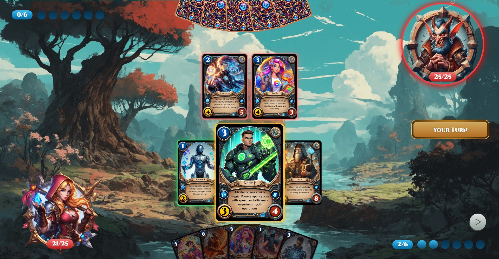

# [Red Stone - A Hearthstone-Inspired Card Game](https://red-stone-game.vercel.app)

**Red Stone** is a card game inspired by the style and mechanics of Hearthstone, built with **React**, **TypeScript**, **Zustand** for state management, **Framer Motion** for animations, **Tailwind CSS** for styling, and **Bun** for bundling. The game is designed as a **Progressive Web App (PWA)**, making it easily installable on both mobile and desktop devices.

## Features
- **Core Game Mechanics**: Full interaction functionality between cards, including attack actions and target selection.
- **Smooth Animations**: Visually engaging animations powered by Framer Motion.
- **Interactive Game Board**: A dynamic and responsive game board styled with Tailwind CSS.
- **AI Gameplay**: Engage in battles against a computer opponent, adding depth and challenge to the game.
- **Card Attack System**: Complete card attack mechanics and target selection on the board.

## Tech Stack
- **React** and **TypeScript** — providing a typed and component-driven front end.
- **Zustand** — lightweight and efficient state management.
- **Framer Motion** — enabling smooth, powerful animations throughout the game.
- **Tailwind CSS** — responsive and modern styling for various screen sizes.
- **Bun** — bundling and dependency management.
- **PWA** — installable on devices, with offline support.

## Installation and Setup
1. Clone the repository:
    ```bash
    git clone <URL>
    ```
2. Navigate to the project directory and install dependencies:
    ```bash
    cd project-folder
    bun install
    ```
3. Start the project:
    ```bash
    bun run dev
    ```
<br><br/>


<br><br/>

<br><br/>


- Replace `plugin:@typescript-eslint/recommended` to `plugin:@typescript-eslint/recommended-type-checked` or `plugin:@typescript-eslint/strict-type-checked`
- Optionally add `plugin:@typescript-eslint/stylistic-type-checked`
- Install [eslint-plugin-react](https://github.com/jsx-eslint/eslint-plugin-react) and add `plugin:react/recommended` & `plugin:react/jsx-runtime` to the `extends` list
